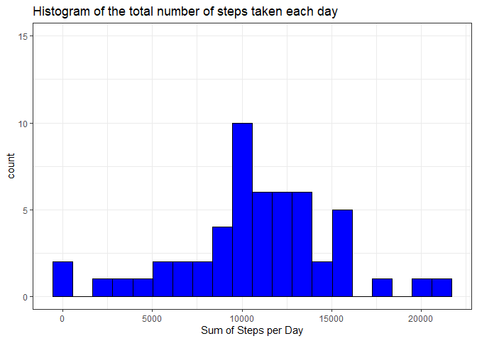
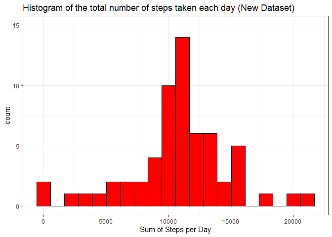
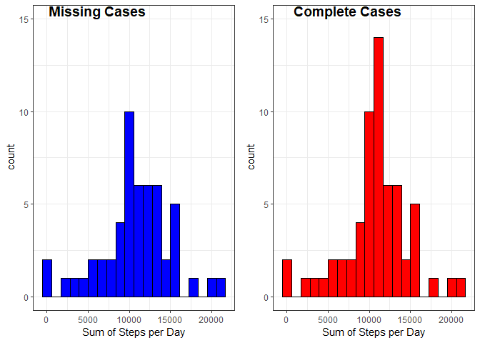
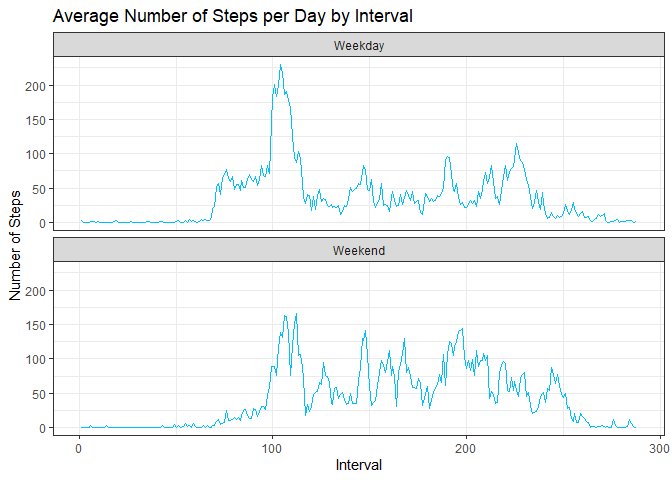

```r
knitr::opts_chunk$set(echo = TRUE)
```

## Loading and preprocessing the data


```r
library(dplyr)
```

```
## 
## Attaching package: 'dplyr'
```

```
## The following objects are masked from 'package:stats':
## 
##     filter, lag
```

```
## The following objects are masked from 'package:base':
## 
##     intersect, setdiff, setequal, union
```

```r
library(ggplot2)
library(ggpubr)
```

```
## Loading required package: magrittr
```

```r
theme_set(theme_pubr())
```


```r
zipped_file <- "activity.zip"
if(file.exists(zipped_file)) unzip(zipped_file)

data <- read.csv("activity.csv")
```

## What is mean total number of steps taken per day?

1. Histogram of the total number of steps taken each day


```r
p1 <- data %>%
  filter(!is.na(steps)) %>%
  mutate(date = factor(date)) %>%
  group_by(date) %>%
  summarise(SumSteps = sum(steps))

plot1 <- ggplot(p1, aes(x=SumSteps)) + 
  geom_histogram(color="black", fill="blue", bins=20)+
  ggtitle("Histogram of the total number of steps taken each day")+
  scale_x_continuous(name="Sum of Steps per Day")+
  scale_y_continuous(limits=c(0,15))+
  theme_bw()

plot1
```

<!-- -->

2. Mean of steps of the total number of steps taken per day


```r
meanp1 <- p1 %>%
  summarise(MeanSteps = round(mean(SumSteps),1))

meanp1
```

```
## # A tibble: 1 x 1
##   MeanSteps
##       <dbl>
## 1    10766.
```


3. Median of the total number of steps taken per day


```r
medianp1 <- p1 %>%
  summarise(MedianSteps = round(median(SumSteps),1))

medianp1
```

```
## # A tibble: 1 x 1
##   MedianSteps
##         <dbl>
## 1       10765
```


## What is the average daily activity pattern?

1. Time series plot of the 5-minute interval (x-axis) and the average number of steps taken, averaged across all days (y-axis)


```r
p2 <- data %>%
filter(!is.na(steps)) %>%
group_by(interval) %>%
summarise(AverageSteps = mean(steps))


plot(p2$interval,p2$AverageSteps, type="l", xlab="Interval", ylab="Number of Steps",main="Average Number of Steps per Day by Interval")
```

<!-- -->

2. The 5-minute interval that contains the maximum number of steps is:


```r
Maxint <- p2[which.max(p2$AverageSteps),]$interval

Maxint
```

```
## [1] 835
```


## Imputing missing values


1. The total number of missing values in the dataset (i.e. the total number of rows with NAs) is:


```r
sum(!complete.cases(data))
```

```
## [1] 2304
```


2. Devise a strategy for filling in all of the missing values in the dataset.

The strategy chosen is the *mean of the 5-minute interval*.


```r
newdata <- data %>%
  mutate(interval=factor(interval)) %>%
  group_by(interval) %>%
  mutate(steps= ifelse(is.na(steps), mean(steps,na.rm = T), steps))
```


3. Create a new dataset that is equal to the original dataset but with the missing data filled in.


```r
head(newdata)
```

```
## # A tibble: 6 x 3
## # Groups:   interval [6]
##    steps date       interval
##    <dbl> <fct>      <fct>   
## 1 1.72   2012-10-01 0       
## 2 0.340  2012-10-01 5       
## 3 0.132  2012-10-01 10      
## 4 0.151  2012-10-01 15      
## 5 0.0755 2012-10-01 20      
## 6 2.09   2012-10-01 25
```

```r
summary(newdata)
```

```
##      steps                date          interval    
##  Min.   :  0.00   2012-10-01:  288   0      :   61  
##  1st Qu.:  0.00   2012-10-02:  288   5      :   61  
##  Median :  0.00   2012-10-03:  288   10     :   61  
##  Mean   : 37.38   2012-10-04:  288   15     :   61  
##  3rd Qu.: 27.00   2012-10-05:  288   20     :   61  
##  Max.   :806.00   2012-10-06:  288   25     :   61  
##                   (Other)   :15840   (Other):17202
```


4. A histogram of the total number of steps taken each day and the mean and median total number of steps taken per day. 

- Histogram (New dataset)


```r
p3 <- newdata %>%
  mutate(date = factor(date)) %>%
  group_by(date) %>%
  summarise(SumSteps = sum(steps))

plot3 <- ggplot(p3, aes(x=SumSteps)) + 
  geom_histogram(color="black", fill="red", bins=20)+
  ggtitle("Histogram of the total number of steps taken each day (New Dataset)")+
  scale_x_continuous(name="Sum of Steps per Day")+
    scale_y_continuous(limits=c(0,15))+
  theme_bw()

plot3
```

<!-- -->

- Mean total number of steps taken per day (New dataset)


```r
meanp3 <- p3 %>%
  summarise(MeanSteps = round(mean(SumSteps),1))

meanp3
```

```
## # A tibble: 1 x 1
##   MeanSteps
##       <dbl>
## 1    10766.
```


- Median total number of steps taken per day (New dataset)


```r
medianp3 <- p3 %>%
  summarise(MedianSteps = round(median(SumSteps),1))

medianp3
```

```
## # A tibble: 1 x 1
##   MedianSteps
##         <dbl>
## 1      10766.
```


4. Do these values differ from the estimates from the first part of the assignment? What is the impact of imputing missing data on the estimates of the total daily number of steps?


```r
figure <- ggarrange(plot1 + ggtitle(NULL), plot3 + ggtitle(NULL),
                    labels = c("Missing Cases", "Complete Cases"),
                    ncol = 2, nrow = 1)
figure
```

<!-- -->

- There are differences in the frequencies of steps as the histograms show.
- The mean of steps per day in the two datasets are idential (mean = 10766.2).
- The median of steps  per day in the dataset with the complete cases (median of new data set = 10766.2) is slightly higher than the dataset with the missing cases (median of the old data set = 10765).


## Are there differences in activity patterns between weekdays and weekends?


```r
p4 <- newdata %>%
  mutate (date = as.Date(date)) %>%
  mutate(DateDay = weekdays(date)) %>%
  mutate (DayType = ifelse (DateDay=="Saturday" | DateDay=="Sunday", "Weekend", "Weekday") ) %>%
  select(-DateDay) %>%
  group_by(interval, DayType) %>%
  summarise(AverageSteps = mean(steps))


ggplot(p4, aes(x=as.numeric(interval), y=AverageSteps)) + 
  geom_line(color="deepskyblue")+
  ggtitle("Average Number of Steps per Day by Interval")+
  scale_x_continuous(name="Interval")+
  scale_y_continuous(name="Number of Steps") +
  theme_bw() +
facet_wrap(~DayType ,ncol=1, strip.position="top")
```

<!-- -->

Yes, there is a difference in the activity patterns between weekdays and weekends.
